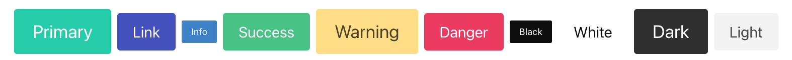

# Responsive Hamburger Nav in Bulma 
with React

[Bulma Docs](https://bulma.io/documentation/overview/start/)

[How to use Bulma in React](https://blog.logrocket.com/how-to-use-bulma-css-with-react/)

**To get started**

For React App:
1. npm install bulma
2. Import bulma into App.js
    1. import 'bulma/css/bulma.css';

For a regular HTML page:
1. This goes in the header of index.html

`<link rel="stylesheet" href="https://cdn.jsdelivr.net/npm/bulma@0.9.4/css/bulma.min.css">`

By importing into App.js or linking in the head of the html, Bulma's components, elements, variables, and more can be used within the project. For React, Bulma only needs to be imported once into the App.js which will share Bulma with children components. 

**Colors**

Sass can be used to create more colors?

**Things to know about:**
1. aria stands for Accessible Rich Internet Applications.
It is a set of attributes used to add HTML elements with improved accessibility for users with disabilities. The aria element is used for screen readers and other assistive technologies. 

2. Most Bulma elements use 
    1. is-
    1. has-

3. Control the state of elements and components
    1. is-outlined
    1. is-loading
    1. disabled
